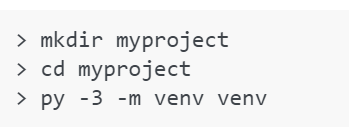
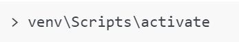
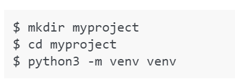
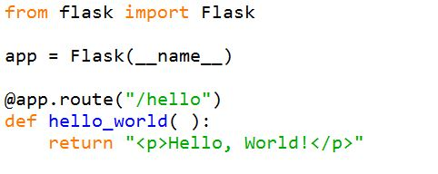
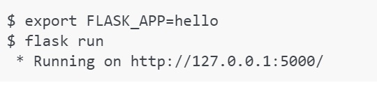
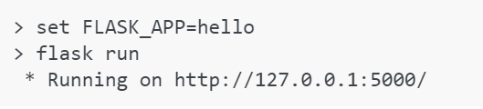
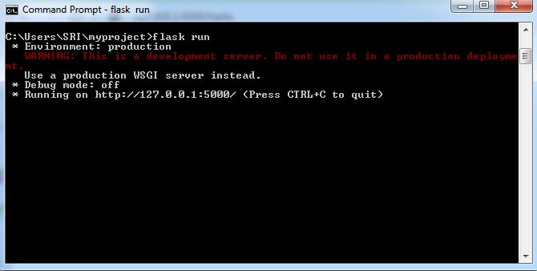
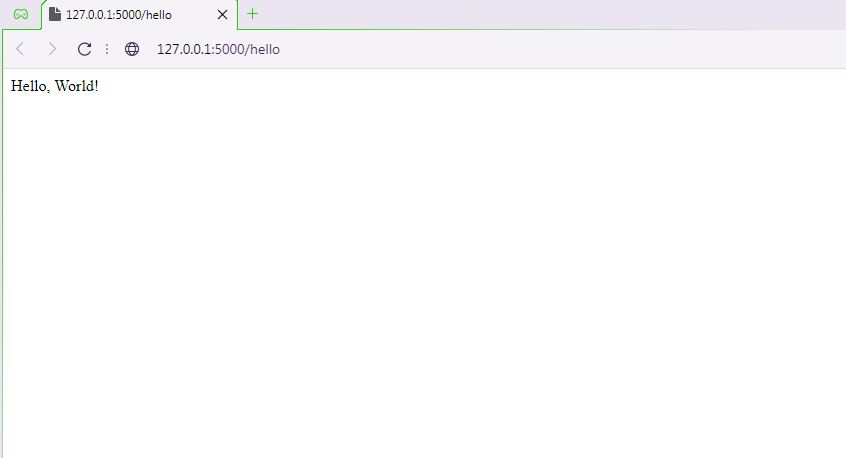

# What is Flask ?


Flask is a micro web framework written in **python**. It's an Application Programming Interface (API) of python and we can build web applications with flask. It was developed by Armin Ronacher. It was based on WSGI (Web Server Gateway Interface) and Jinja2 template engine. Flask has a less code to implement a simple web application and easier to learn.

## Flask as a Micro Web-Framework

* A web-framework is a software framework that is designed to support the development of web applications including web services, web resources, and web APIs. Web frameworks provide a standard way to build and deploy web applications on the World Wide Web.


* The “micro” in microframework means Flask aims to keep the core simple but extensible. Flask won’t make many decisions for you, such as what database to use. Those decisions that it does make, such as what templating engine to use, are easy to change. Everything else is up to you, so that Flask can be everything you need and nothing you don’t.


* By default, Flask does not include a database abstraction layer, form validation or anything else where different libraries already exist that can handle that. Instead, Flask supports extensions to add such functionality to your application as if it was implemented in Flask itself. 


* Numerous extensions provide database integration, form validation, upload handling, various open authentication technologies, and more. Flask may be “micro”, but it’s ready for production use on a variety of needs.

## Setting up Flask on Windows/ Linux / OSX Enviroment

Flask supports Python 3.6 and newer. So make sure that pyhton version installed in your computer is above 3.6
It is recommended to have latest version of Python on your computer.

#### Dependencies

Some distributions will install automatically when installing Flask. So don't be overwhelmed when you see these while installing Flask

* **Werkzeug**: implements WSGI, the standard Python interface between applications and servers.


* **Jinja**: is a template language that renders the pages your application serves.


* **MarkupSafe**: comes with Jinja. It escapes untrusted input when rendering templates to avoid injection attacks.


* **ItsDangerous**: securely signs data to ensure its integrity. This is used to protect Flask’s session cookie.


* **Click**: is a framework for writing command line applications. It provides the flask command and allows adding custom management commands.

## Virtual Environments

* We would use virtual enviroment to manage the dependencies for a project.


* Virtual environments are independent groups of Python libraries, one for each project. Packages installed for one project will not affect other projects or the operating system’s packages.


* The more Python projects we have, the more likely it is that we need to work with different versions of Python libraries, or even Python itself. 


* Newer versions of libraries for one project can break compatibility in another project. So In that case, virtual environment solves the issue.


-----> Python comes bundled with the **_venv_** module to create virtual environments.

### Installing Flask on Windows

**Step-1: Create a Virtual Environment**

* Create a project folder and within that create **venv** folder
* We can do the above task by executing some commands in command prompt.



**Step-2: Activate the environment**

* Before working on a project, we have to activate corresponding environment
* Activate the environment by executing following command.



* Whenever environment is activated, prompt will change to name of activated environment.

**Step-3: Now we will Install Flask within the activated environment by executing following command**

 ### > pip install Flask

* Now Flask was successfully installed. We can start working on it now.

### Installing Flask on Linux / OSX

Installing flask in Linux / OSX is similar to windows installation. But some commands will change.

**Step-1: Create a virtual environment**



**Step-2: Activate the environment**


**Step-3: Install Flask in Activated environment**


*We have installed the flask successfully. Now we will make a simple web application using flask.*

## A Simple Web Application

Suppose you have installed flask in path "C:\Users\Username\projects". 

That means you can find **venv** folder inside the projects folder.

Now create a python file named as "app.py" in projects folder.

Open the 'app.py' with python IDLE

Then start write the below code for your first flask web application

**app.py**



#### What code trying to say ?

* First we imported the Flask class and an instance of this class will be our WSGI application


* Next we create an instance of this class. The first argument is the name of the applicatio's module or package.


* __name__ is a convenient shortcut for this that is appropriate for most cases. This is needed so that Flask knows where to look for resources such as templates and static files.


* We then use the route() decorator to tell Flask what URL should trigger our function.


* The function returns the message we want to display in the user’s browser. The default content type is HTML, so HTML in the string will be rendered by the browser.


* save it as app.py or hello.py or something similar to that. But do not name it as Flask.py because it conflicts with Flask itself.

##### Before running the application, we need to tell terminal the application to work with by exporting the FLASK_APP environment variable

**NOTE: If the file is named "app.py" or "wsgi.py", we don’t have to set the FLASK_APP environment variable. Just simply the command *flask run* will be enough to run application**

**Run the following commands if it is Bash**:


**here we named the file as hello.py so We will assign hello to the environment variable like** *set FLASK_APP=hello*

**Run the following commands if it is CMD**:



**Run the following commands if it is Powershell:**


**Here We can see what it look likes in a command prompt typically:**



**Now Open the browser and go to the URL** http://127.0.0.1:5000/hello. 
* Since we route the app when **/hello** is passed as mentioned in code, we add **/hello** to the url at the end. we can do as many routes we want.

**Then we will see the Hello, World! in the page as output shown below**



**We can explore more things when going on with flask. It's simple and powerful to implement web applications with Flask**

### RESOURCES

[Flask official Documentation](https://flask.palletsprojects.com/en/2.0.x/)


```python

```
